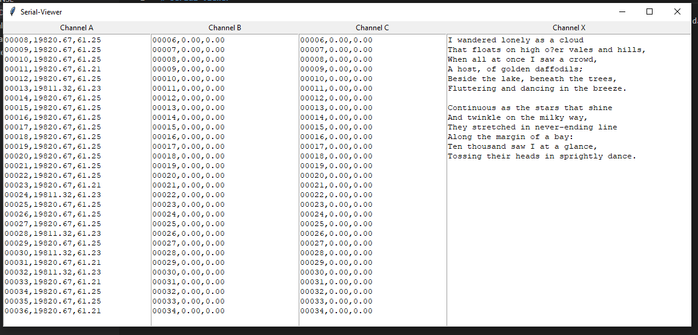

# Serial-Viewer
The Serial-viewer is a program that filter out and show the serial data. The filtering is done on the concept of channel. A channel is like a sub-serial terminal, this allow one to use a single serial port to display different data, and filter and separate them as the arrive.

## Prerequires

1. python
2. pyserial 

## Usage

To run the program use the command.

```shell
python serial-viewer.py
```

## Preview


